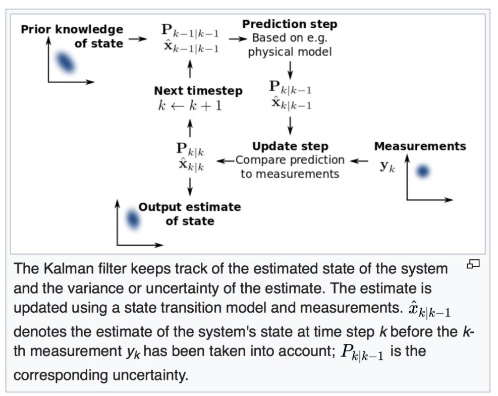

# Autonomous System Interview Practice Project (Perception Sensor Engineer)

## General

---
#### Q1: What is the importance of simulation in the testing of autonomous systems? What additional items do you need to consider in order to leverage this type of testing (or training) to real-world environments?

#### A:
Currently, a lot of research and development is underway for autonomous driving systems, but various test environments are required to commercialize them as a system with high stability. If you test in a real environment, as you know, there is a drawback that it consumes a lot of time and money. However, if you use simulations similar to real-world environments, you can develop various algorithms as well as mitigate the shortcomings. In addition, the cognitive, judgment, and control algorithms used in the simulation must be designed in consideration of the actual environment.

## Mandatory

---
#### Q2:What are some of the advantages & disadvantages of cameras, lidar and radar? What combination of these (and other sensors) would you use to ensure appropriate and accurate perception of the environment?

#### A:
Camera: A camera is basically a sensor that grabs multiple color points in space and arranges them into an image, also known as image array. These image arrays are converted into digital signals and passed to hardware that performs sensor fusion and scene understanding.

Lidar: LiDAR is a laser illumination point-and-shoot methodology for detecting the world. The transmitter emits some light and waits for that light to bounce off the object. And because you know how fast the light travels, you can determine how far an object is by determining the time elapsed between sending and receiving light. Typical LiDAR devices include a device from Velodyne company with a light wavelength of 905nm that rotates in a circle and can widen the field of view using multiple lasers, and LiDAR from Luminar, which has a light wavelength of 1550nm. After being received, the LiDAR system sends back a series of direction and distance information called "point clouds" to the hardware for sensor fusion and scene understanding.

Radar: Radar has existed forever. It is similar to LiDAR in that it is a "point-and-shoot" technique, but it uses radio or electromagnetic waves to do this. Radars are suitable for detecting objects over long distances, but they are generally not very accurate.

#### Q3:Describe the overall process of how a basic Kalman Filter works. Where might a basic Kalman Filter be less than sufficient? How can you improve the basic algorithm to improve performance in such a situation?

#### A:
The Kalman filter, also known as linear quadratic estimation, is an algorithm that helps you get a reliable estimate from the values ​​measured by the sensor. Typically, it is used to track the position and speed of a moving vehicle or pedestrian over a certain period of time, and to measure the associated uncertainty. It basically consists of repeating prediction and updating.
In the Kalman filter algorithm, the Kalman gain is a parameter that determines how much weight should be given to the predicted and measured values. After checking the uncertainty of the predicted value and the measured value, it is determined whether the actual value is close to the predicted value or the measured value.

#### Gain(K) = prediction error / (prediction error + measurement error)

Measurement errors generally depend on the sensor's hardware capabilities. Typically, the manufacturing company reports the standard deviation of the measurements that can be obtained from the sensor. The calculation of the output range based on the standard deviation is that if the deviation is 5 and the actual measured value is 200, the sensor provides an output range of 195 to 205.

The prediction error starts with a large error and then gradually decreases through repeated measurements. The default Kalman filter has a nonlinear measurement function that is not a result of Gaussian results, and if the Kalman filter equation cannot be used, an algorithm such as EKF or UKF is used. 

[Youtube_KalmanFilter](https://www.youtube.com/watch?v=Fuy73n6_bBc)

#### Q4:How does an Extended Kalman Filter differ from a regular Kalman Filter? Provide an example of where an EKF would be necessary or improvement, and detail why it would be needed in that situation.

#### A:
Extended Kalman filters use a linear approximation approach to regular Kalman filters. Extended Kalman filter and Kalman filter equations used if the result is not Gaussian like radar/rider is not available via Taylor series expansion. Lidar provides distance in a Cartesian coordinate system, whereas radar provides distance and speed in a polar coordinate system.

#### Q5:What is the difference between an Extended Kalman Filter and an Unscented Kalman Filter? In what situations would there be larger differences between the two approaches?

#### A:
The difference between EKF and UKF is, first of all, EKF has only one point, mean and approximation, but UKF has several points called sigma points, so it has higher accuracy than EKF. In addition to the sigma points, there are weights, and the estimates estimated through them are calculated more similarly.

## Code

___
#### Q6:Explain the steps behind how an Extended Kalman Filter is implemented.

#### A:
Refer to the code in the folder above and refer to Extended Kalman Filter.
First, taking the measured data and combining them together is called sensor fusion.
Data is input and initialized in matrix form of another sensor. The file included to implement the Kalman filter is a header file.
The data is supplied as Gaussian nonlinear data received from the radar, and an approximate value is obtained is called Extended Kalman Filter.

### Prediction

The prediction step is the same as the Kalman filter, and it doesn't matter whether the data comes from LiDAR or Radar. That is, the prediction steps are the same.

### Update

Equation 1:

Here, (z) is the actual measured value of the polar coordinates, (h) is the function to specify how to map the speed and position to the polar coordinates, (x') is the predicted value, and (y) is the difference between the measured value and the actual value.

This is a function that specifies the mapping between Cartesian coordinates and predicted values in polar coordinates. This mapping is predicted in Cartesian coordinates, but it is necessary because the measured value (z) coming from the sensor is in polar coordinates.

Equation 2:

(R) = Measurement Noise, (K) = Kalman Gain, (S) = Total Error, (S^-1) = The Inverse of S, (Hj) = The Jacobian Matrix

Hj is the Jacobian Matrix. The Jacobian Matrix is the first derivative in the Taylor Series, where you need to find the derivative of the matrix form.

J_kl = d F_k / dX_l J_kl is the k, l elements of the Jacobian matrix, F_k is the kth element of the vector function F, and X_l is the lth element of the vector variable X. Where F_k = {ρ, Φ, ρ_dot} X_l = {px, py, vx, vy}

For Radar, there are 4 measurements, so 2 is distance and 2 is speed.

Equation 3:

In three stages
#### [Initialization and status check -> prediction -> update]
